# job4j_cinema
### На главной странице http://localhost:8888 (она же `Главная` в навигационном меню)
### Отображаются все фильмы
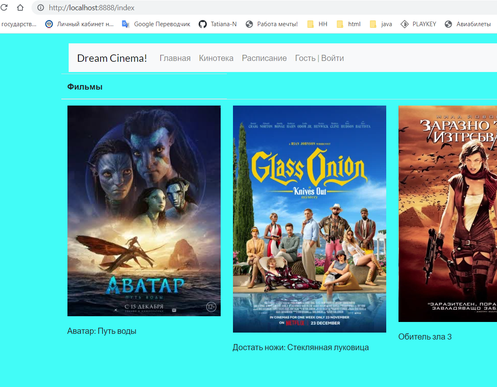
### Фильм можно выбрать и перейти на его страницу со страницы _`КИНОТЕКА`_
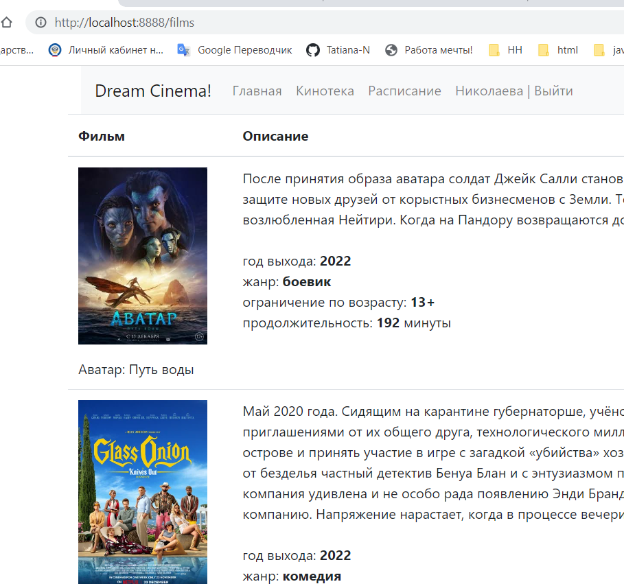
### Или со страницы `РАСПИСАНИЕ`
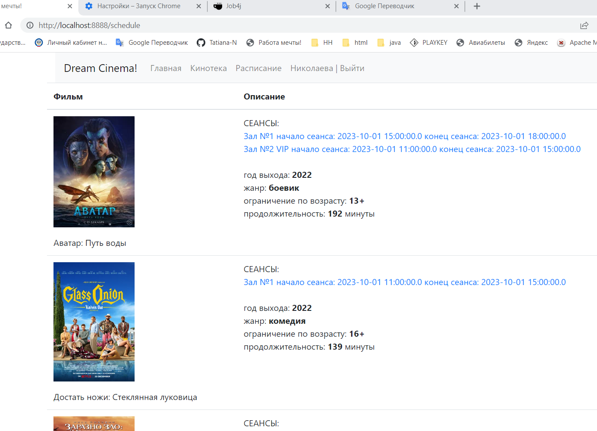
### На странице фильма будет доступно его полное описание и все сеансы
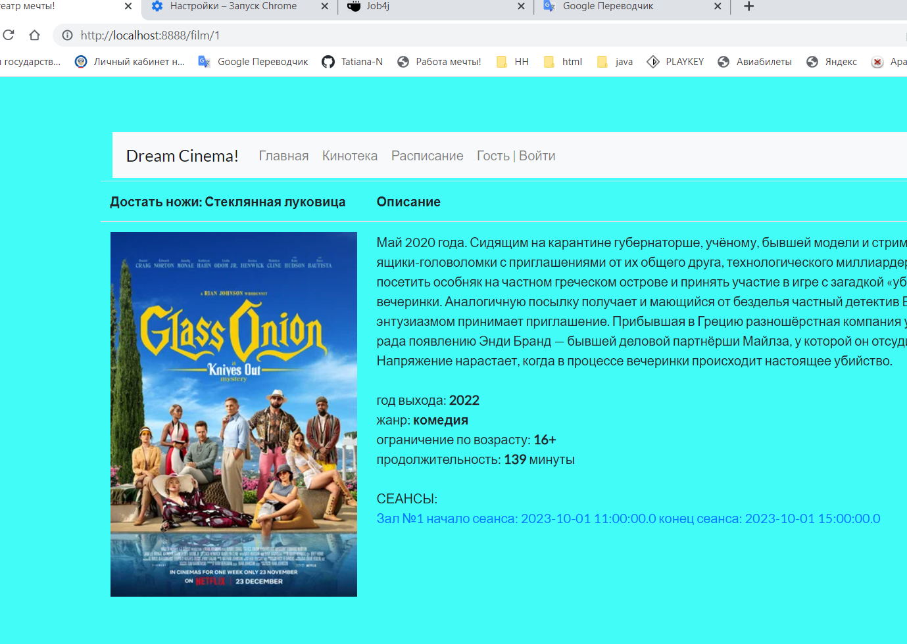
### Выбрав и перейдя на сеанс, увидим зал и занятые места
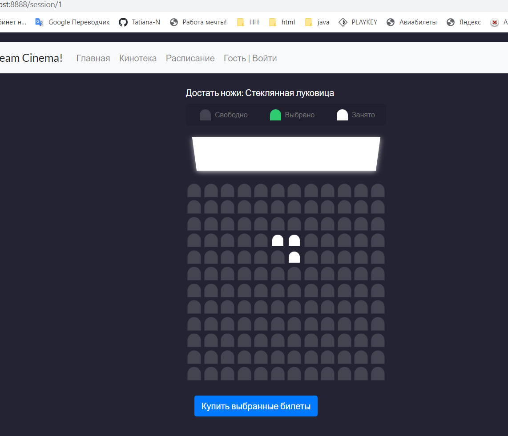
### Для того чтобы выбрать места, придется зарегистрироваться или войти, 
### Гости сайта не могут выбирать места для последующей покупки, их перенаправит на страницу `АВТОРИЗАЦИИ`
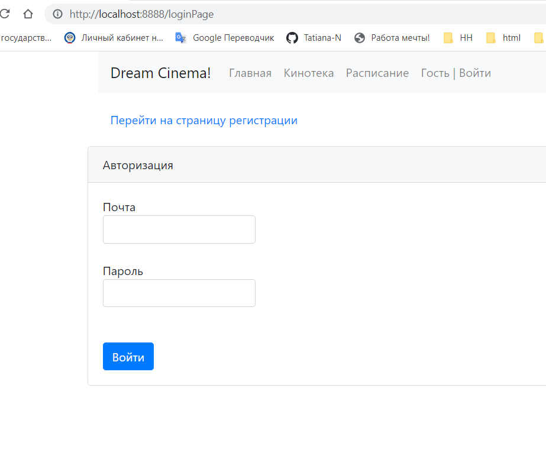
### На этой странице есть ссылка для перехода на страницу `РЕГИСТРАЦИИ`, если у Вас еще нет аккаунта
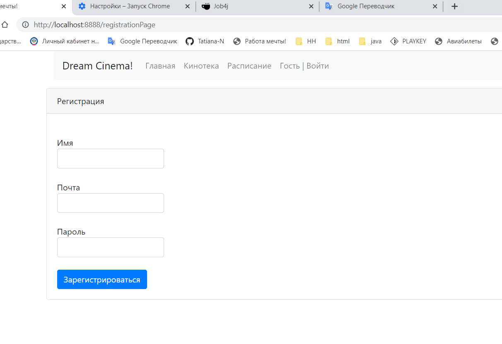
### Авторизованный пользователь с любой страницы может` выйти `из аккаунта
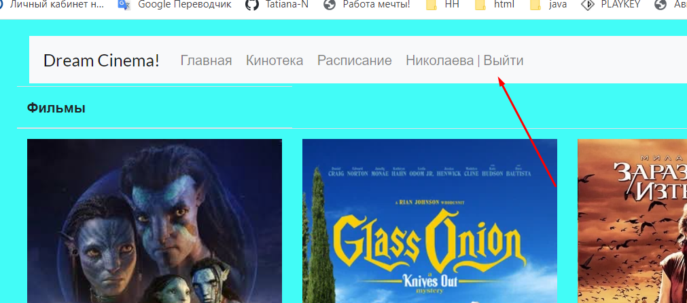

###  Авторизовавшись можете выбирать места на выбранный сеанс
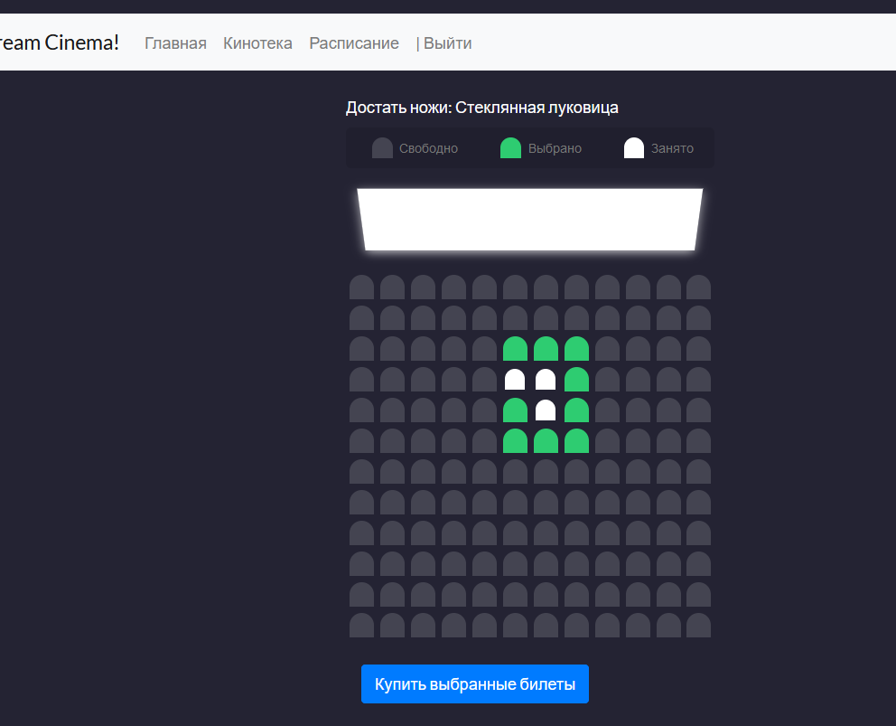
### Можем выбрать количество билетов которое хотим
### Выбрать уже купленные места нельзя
### Щелкнув второй раз по выбранному месту - выбор отменяется
### Для покупки нажимаем кнопку `КУПИТЬ ВЫБРАННЫЕ БИЛЕТЫ`
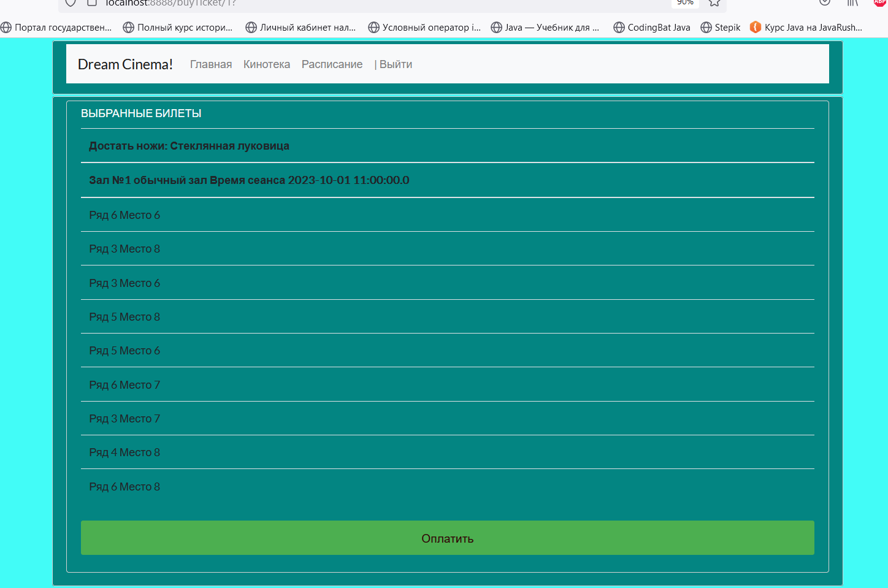
### На странице оплаты отображается название фильма, время и название зала 
### Отображается список выбранных мест
### Нажимаем оплатить, в БД сохраняются купленные билеты
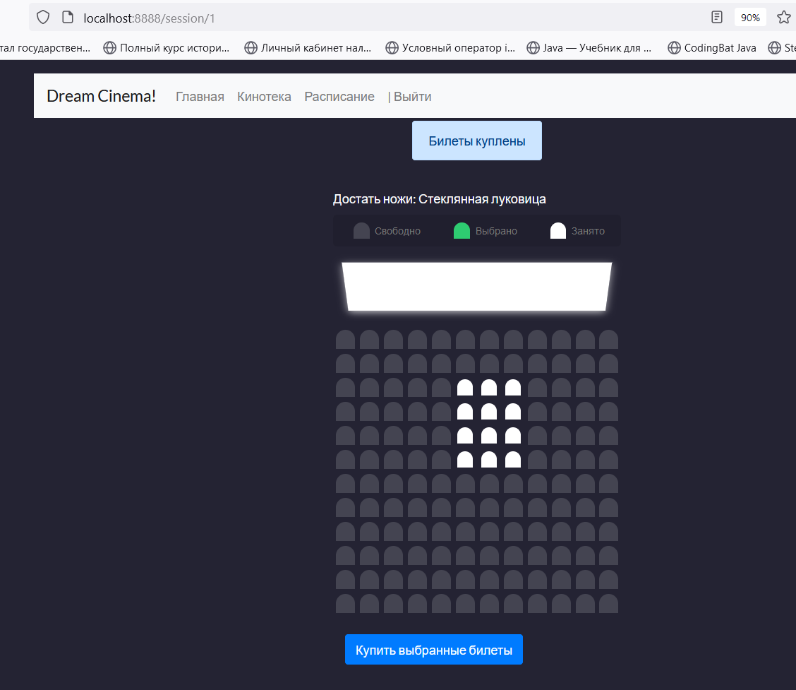
### Разные пользователи могут выбирать одни и те же билеты, 
### Но при покупке одним из них, выбор второго будет снят
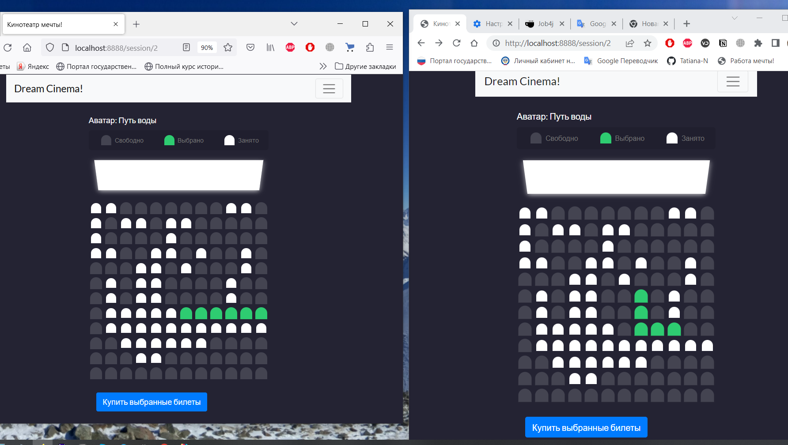
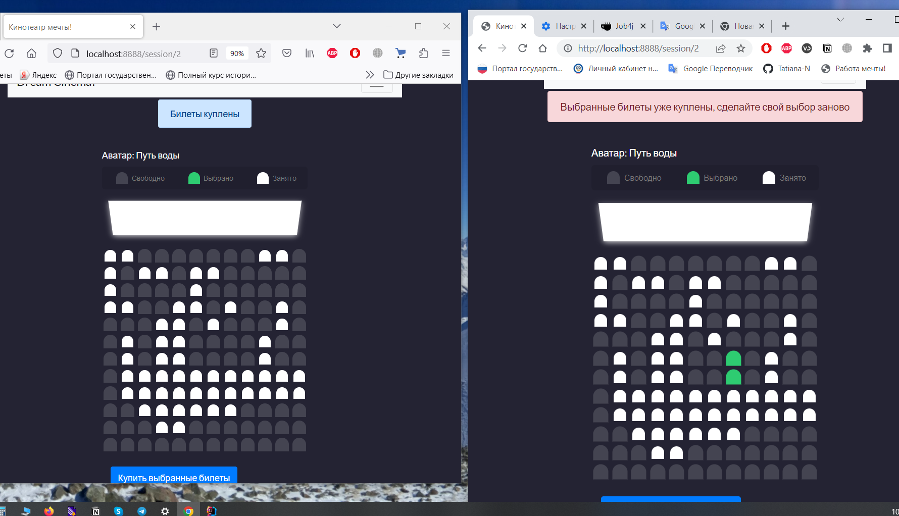

