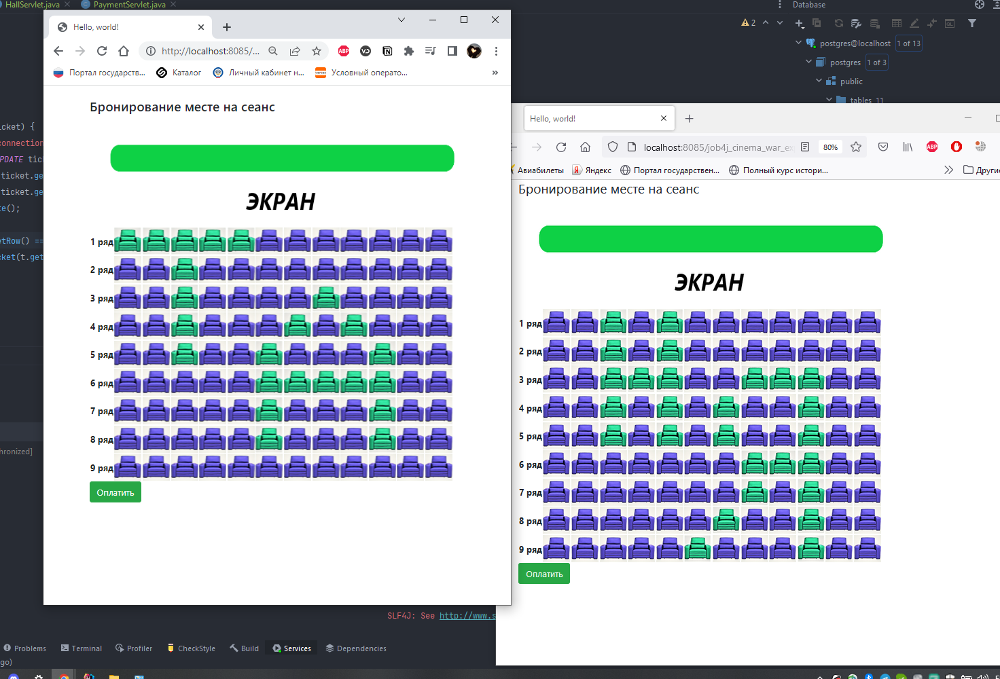
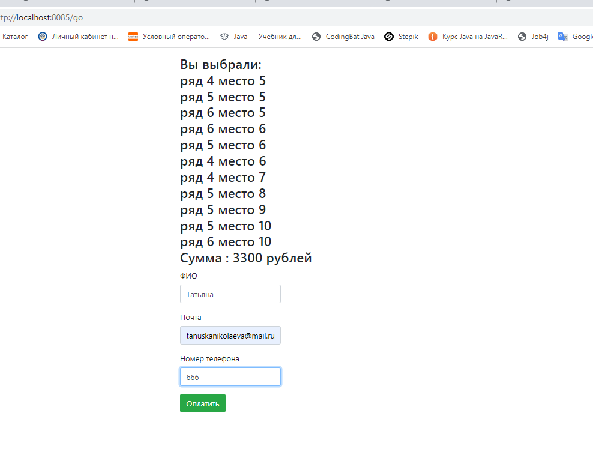
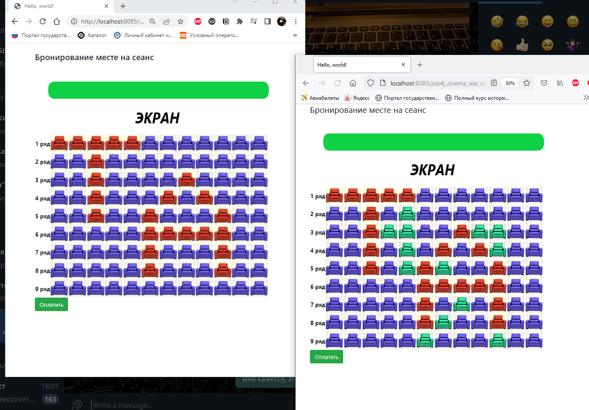

# job4j_cinema
### На главной странице http://localhost:8085/go выбираем билет 
### -> нажимаем на кресло которое хотим купить 
### -> происходит бронирование

### Можем выбрать количество билетов которое хотим

### Для покупки нажимаем кнопку оплатить
### Отображается список выбранных мест и сумма для оплаты
### в поля ввода вводим Имя Почту и Номер телефона
### Нажимаем оплатить, в БД сохраняются купленные билеты
#### Если пользователь с таким телефоном, но другой почтой уже покупал билеты, то будет предложено еще раз заполнить данные поля

### Разные пользователи могут бронировать одни и те же билеты, 
### Но при покупке одним из них, бронь второго будет удалена из БД 

